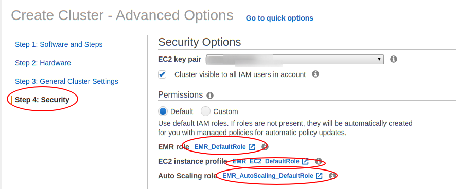
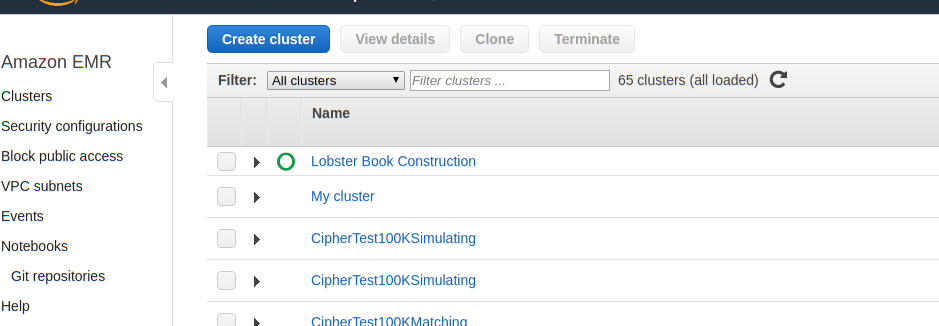
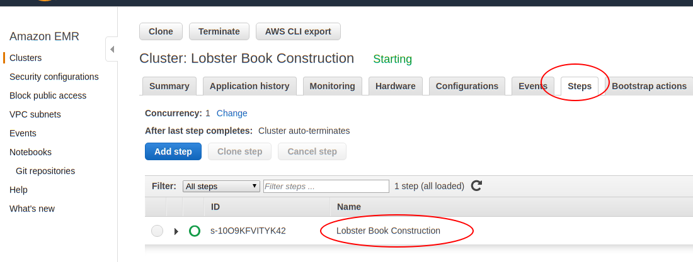
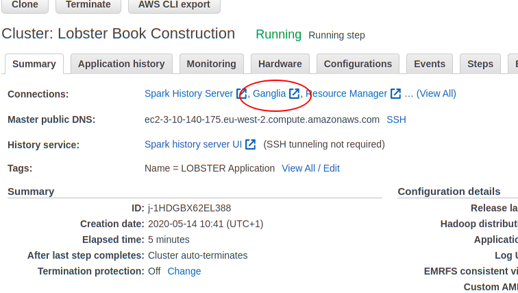
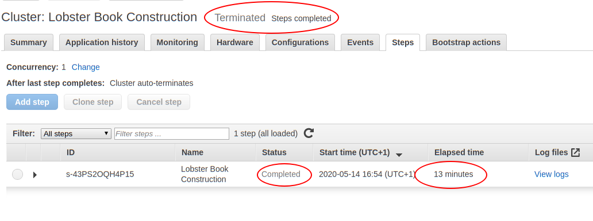

# LOBSTER on AWS 
 The beta version of LOBSTER engine developed by [frischedaten UG](https://lobsterdata.com) has been designed to 
 utilize the powerful computation and storage capacity of Amazon AWS. It runs on top of Apache Spark,
 which are standard packages in [Amazon AWS EMR](https://aws.amazon.com/emr/) release. 
 In this project, I develop a python wrapper that
 1. Sets up and starts an EMR cluster;
 2. Runs the order book construction as a step of the EMR; 
 3. Shuts down the cluster for saving costs once task is completed; and finally
 4. Reviews the order book. 
 
 ## Prerequire
 In order to try out the new powerful LOBSTER engine, you need
 1. An Amazon AWS account and an IAM user who is allowed creating and running EMR;
 2. An [S3 bucket](https://docs.aws.amazon.com/AmazonS3/latest/gsg/CreatingABucket.html) for storing the output; 
 3. [Amazon AWS CLI Version 1 installation](https://docs.aws.amazon.com/cli/latest/userguide/cli-chap-install.html) 
    on your local machine 
 2. Python 3 installation on you local machine. For people who like to use Spark to read demo output, the python version
    should be ``3.7``, because ``pyspark`` does not support ``3.8`` so far; and
 4. Python packages: ``pandas``, ``matplotlib``,  ``jupyterlab`` and ``pyarrow``. Additional ``pyspark`` for people like to use Spark.
 
 Note that this version of wrapper uses the default role setting of EMR, please make sure that those roles exist and are 
 visible for the user.
 
 A simple way to create all those roles is create a cluster in EMR with Quick Options in 
 [EMR interface in Amazon S3 console](https://eu-west-2.console.aws.amazon.com/elasticmapreduce/).
 
 ## Run the Constructing Program
 After cloning the repository, please familiarise yourself of the usage of ``construct_order_book.py``.
 ```bash
$ python demo/construct_order_book.py --help
usage: construct_order_book.py [-h] -t TASK_FILE -k KEY_NAME -i INPUT_PATH -o
                               OUTPUT_PATH [-g INSTANCE_GROUPS] [-j JAR_FILE]
                               [-f OUTPUT_FORMAT] [-r REGION]
                               [-p CREDENTIAL_PROFILE] [-n NUM_PARTITIONS]

Construct order book using LOBSTER engine

optional arguments:
  -h, --help            show this help message and exit
  -t TASK_FILE, --task_file TASK_FILE
                        S3 task file. Example file: s3://demo-ordermessage-
                        lobsterdata-com/NASDAQ100-2019-12-30.txt
  -k KEY_NAME, --key_name KEY_NAME
                        EMR pair key name
  -i INPUT_PATH, --input_path INPUT_PATH
                        Input path. The default is s3://demo-ordermessage-
                        lobsterdata-com
  -o OUTPUT_PATH, --output_path OUTPUT_PATH
                        Output path. Required. S3 location.
  -g INSTANCE_GROUPS, --instance_groups INSTANCE_GROUPS
                        Instance group configure JSON file
  -j JAR_FILE, --jar_file JAR_FILE
                        The jar file contains LOBSTER engine. The default
                        location is s3://bookconstructor-lobsterdata-com/com-
                        lobsterdata-bookconstructor_2.11-0.1.jar
  -f OUTPUT_FORMAT, --output_format OUTPUT_FORMAT
                        Output format. It could be parquet or csv. The default
                        is parquet
  -r REGION, --region REGION
                        EMR region. Default is eu-west-2
  -p CREDENTIAL_PROFILE, --credential_profile CREDENTIAL_PROFILE
                        AWS credential profile. Default is 'default'
  -n NUM_PARTITIONS, --num_partitions NUM_PARTITIONS
                        The number of partitions for output files. Lobster
                        engine always partitions the output by symbols. If
                        choose 0, the number of the partition will be
                        automatically determined by Spark.
 ``` 
 * TASK_FILE: Required argument. The file contains the all requests, including stock, start date, end date and order book level. 
    an example of request file has been stored at s3://demo-ordermessage-lobsterdata-com/NASDAQ100-2019-12-30.txt.
    This file contains 103 requests of 10-level order book on 30th December, 2019.
 * KEY_NAME: Required argument. It is the 
    [Amazon EC2 key pair](https://docs.aws.amazon.com/AWSEC2/latest/UserGuide/ec2-key-pairs.html) 
    for you to access the EMR cluster. 
 * INPUT_PATH: Required argument. S3 prefix for original ITCH message data.
    <!-- 
    * LOBSTER official subscriber: the LOBSTER team is preparing a quarter data for beta test. 
      The location and the IAM guidance will be release to you soon.
      -->
    * Demo: the LOBSTER team has 30th December 2019 data open to public at  s3://demo-ordermessage-lobsterdata-com
 * OUTPUT_PATH: Required argument. S3 prefix for output the data. 
    Note that the two more sub-prefix will create for the output. 
    * OUTPUT_PATH/log: the log information of the construction
    * OUTPUT_PATH/orderbook: the output order book data partitioned by date
 * INSTANCE_GROUPS: Optional argument. It is the uniformed instance configuration for the cluster. 
    If not provided, the wrapper will pick up ``demo_config/construct_book_instance_groups.json`` as the configure file.
    This configuration include auto-scaling setting. 
    It could one to ten m5.4xlarge EC2 instances, depending the loading.
 * JAR_FILE: Optional argument. This is the Jar file contains LOBSTER engine. The current location is
    s3://bookconstructor-lobsterdata-com/com-lobsterdata-bookconstructor_2.11-0.1.jar.
 * OUTPUT_FORMAT: Optional argument. It could be parquet or csv. The default is parquet.
 * REGION: Optional argument. The region of cluster. The default is eu-west-2, i.e. London.
 * CREDENTIAL_PROFILE: Optional argument. The user's 
    [credential file](https://docs.aws.amazon.com/cli/latest/userguide/cli-configure-files.html) 
    for creating EMR cluster. Default is default. 
 * NUM_PARTITIONS: Optional argument. It is the number of partitions of the output order book. If it is set to zero,
    the number of the partitions will be determined by Spark configuration. 
    Note that in any case, LOBSTER will partition the output by ``date`` and ``symbol``. 
    So the number of partitions could be simply understood as the number of output files in a day.
 
Here is an example of constructing with minimum argument.
```bash
python construct_order_book.py \
    -t s3://demo-ordermessage-lobsterdata-com/NASDAQ100-2019-12-30.txt \
    -k <my paired key without .pem> \
    -o s3:<ouput prefix or bucket> \
    -i s3://demo-ordermessage-lobsterdata-com
```
The wrapper will then ask you to double check the settings:
```text
 You are about to start the following task on AWS:
    * Task file: s3://demo-ordermessage-lobsterdata-com/NASDAQ100-2019-12-30.txt
    * Instance groups: <work directory>/demo/config/construct_book_instance_groups.json
    * Input path: s3://demo-ordermessage-lobsterdata-com
    * Output path: s3:<output prefix or bucket>
    * Output format: parquet
    * Number of partition: 10 (0 means using Spark default number)
    * Lobster engine jar file: s3://bookconstructor-lobsterdata-com/com-lobsterdata-bookconstructor_2.11-0.1.jar
    * EMR pair key: <my paired key without .pem>
    * Region: eu-west-2
    * Log location: s3:<output prefix or bucket>/log
    Please confirm (yes or no) >> 
```
 Once you confirm those information by ``yes``, the cluster will be kicked off.
## Monitor the Constructing Process
If the command line has been executed successfully, you should see a output such as
```text
{
    "ClusterId": "j-1CREQ25V98G5O",
    "ClusterArn": "arn:aws:elasticmapreduce:eu-west-2:497960385777:cluster/j-13AIH5MWUVROR"
}
```
An new cluster called ``Lobster Book Construction`` will also show up in your 
[cluster list](https://eu-west-2.console.aws.amazon.com/elasticmapreduce) as the following. 
If you cannot see this, please double check that the region setting at the top left of the web page is consistent
with the region in which you create the cluster.


Click on ``Lobster Book Construction`` to enter the description of the cluster. 
In the steps page, you will see that the task ``Lobster Book Construction`` has been associated.


Further more your can enable web connection on the ``Summary``, following the guidance provided by Amazon AWS team.
The wrapper indeed has installed Ganglia in the cluster, 
you can use it to monitor the resources usage of the cluster.
  

Once the task has been completed, the cluster will be shut down automatically.
 

## Investigate the Order Book
Download the order book data to your local machine. 
```bash
$ aws s3 sync s3:<your output S3 bucket or prefix> <your local directory>
```